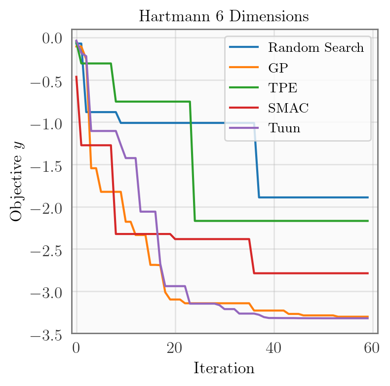
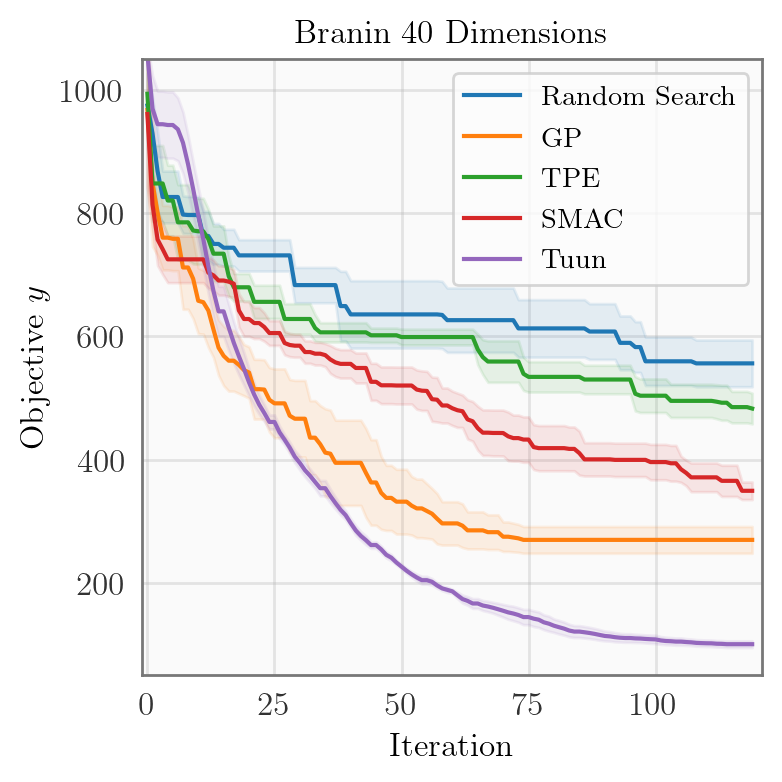

<p align="center"></p>

**Tuun** is a toolkit for efficient hyperparameter tuning via uncertainty
modeling, with a focus on flexible model choice, scalability, and use in
distributed settings.

## Installation

Tuun requires Python 3.6+. To install all dependencies for development, run:
```
$ pip install -r requirements/requirements_dev.txt
```

For the full functionality of Tuun, a [Stan](https://mc-stan.org/) model must also be
compiled (this takes roughly 1 minute) by running:
```
$ python tuun/probo/models/stan/compile_models.py -m gp_distmat_fixedsig
```


## Quick Start
Here is a minimal working example, which uses Tuun to optimize a function via Bayesian
optimization.

```python
from tuun.main import Tuun

tu = Tuun()

search_space = ('real', [[-5, 5]])
tu.set_config_from_list(search_space)

f = lambda x: x[0] ** 4 - x[0] ** 2 + 0.1 * x[0]
result = tu.minimize_function(f, 20)
```
This should find a minima at roughly: 𝑥\*=−0.73, 𝑓(𝑥\*)=−0.32.

Tuun also allows for fine-grained configuration of individual components and search
spaces.

```python
from tuun.main import Tuun

config = {
    # configure model
    'model_config': {'name': 'simplegp', 'ls': 3.0, 'alpha': 1.5, 'sigma': 1e-5},

    # configure acquisition function
    'acqfunction_config': {'name': 'default', 'acq_str': 'ei'},

    # configure acquisition optimizer
    'acqoptimizer_config': {'name': 'default', 'max_iter': 200},

    # configure domain
    'domain_config': {'name': 'real', 'min_max': [(-5, 5)]},
}
tu = Tuun(config)

f = lambda x: x[0] ** 4 - x[0] ** 2 + 0.1 * x[0]
result = tu.minimize_function(f, 20)
```
This should find a minima at roughly: 𝑥\*=−0.73, 𝑓(𝑥\*)=−0.32.


## Examples
<p align="center">
    
    &nbsp; &nbsp;
    
</p>
